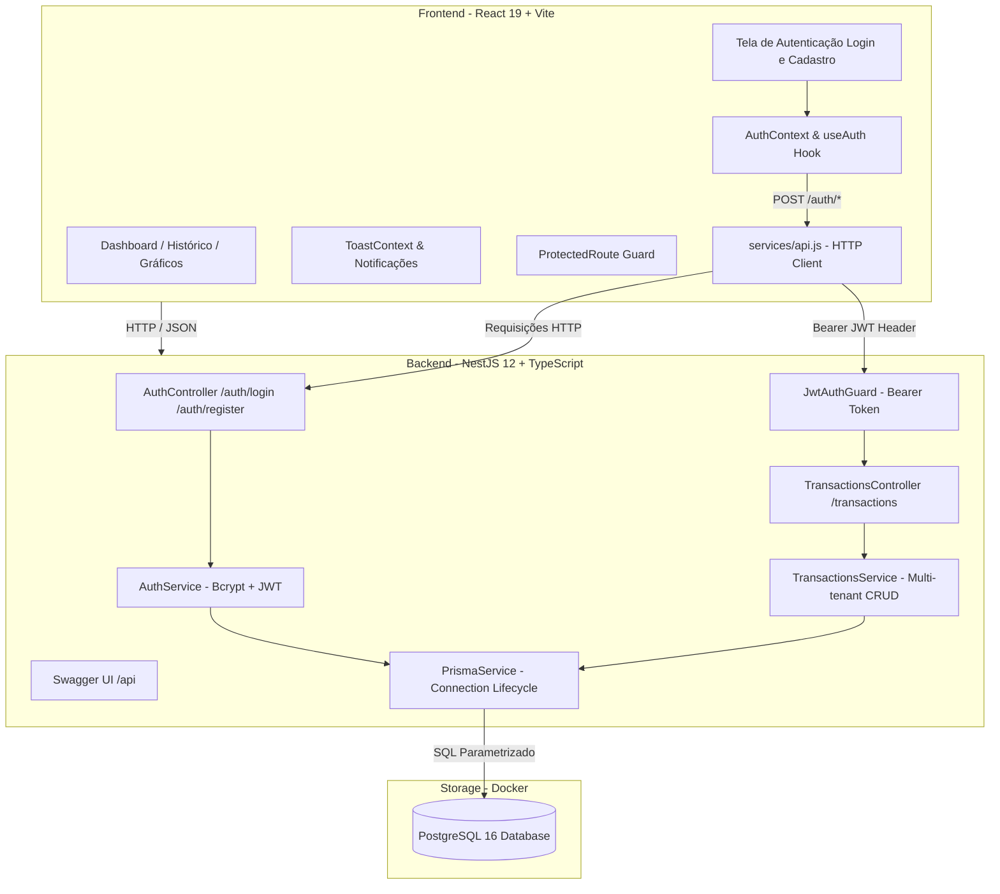

# 💰 Your Finances — Full-Stack Personal Finance Platform

<p align="center">
  
  
  
  
  
  
  
  
</p>

---

## 📌 Sobre o Projeto & Case de Engenharia

O **Your Finances** é uma plataforma completa e moderna de gestão financeira pessoal construída sob os mais altos padrões de arquitetura de software e boas práticas de desenvolvimento web full-stack.

### 💡 O Case da Migração (De NoSQL para Relacional Corporativo)
Originalmente, a aplicação utilizava Firebase (Firestore / Realtime Database) com regras simplificadas de cliente. Com foco em segurança, integridade financeira e escalabilidade corporativa, foi conduzida uma **migração de ponta a ponta**:
1. **Banco de Dados Relacional**: Substituição do NoSQL pelo **PostgreSQL 16** via Docker, com chaves estrangeiras, `ON DELETE CASCADE`, precisão monetária estrita com `Decimal(10,2)` e enums tipados.
2. **Camada de ORM Type-Safe**: Adoção do **Prisma 6** operando em modo estrito (Zero `any`), garantindo integridade referencial e tipagem estática ponta a ponta.
3. **Backend Corporativo Modular**: Construção do backend em **NestJS 12**, implementando Injeção de Dependências (IoC), Guards de autenticação JWT, DTOs e documentação interativa via **Swagger/OpenAPI**.
4. **Refatoração do Frontend**: Desconexão total do Firebase no React, introduzindo Context API para autenticação, rotas protegidas, notificações via Toasts e cliente HTTP centralizado.

---

## 🏗️ Arquitetura do Sistema



---

## ✨ Principais Funcionalidades

- **🔐 Autenticação Completa & Multi-Tenant**:
  - Cadastro e login com hash de senha via `bcryptjs`.
  - Assinatura e verificação de tokens JWT via `JwtAuthGuard`.
  - Isolamento estrito de dados: nenhum usuário consegue visualizar, alterar ou excluir lançamentos de outro usuário (`where: { id, userId }`).
- **💰 Gestão de Transações**:
  - Lançamento de Receitas e Despesas com categorias dinâmicas.
  - Edição e exclusão segura com feedback instantâneo.
  - Paginação, buscas em tempo real e filtros combinados por data e tipo.
- **📊 Gráficos e Inteligência Financeira**:
  - Análise de fluxo de caixa mensal e anual via gráficos de barras interativos (`Recharts`).
  - Distribuição percentual de despesas por categoria em gráfico de rosca (donut chart).
- **📚 Documentação OpenAPI / Swagger**:
  - Interface interativa gerada automaticamente em `/api` para testes e inspeção de schemas DTOs.
- **🎨 UI / UX Moderna**:
  - Alternância de tema **Dark / Light** com persistência no `localStorage`.
  - Sistema de notificações flutuantes (**Toasts**) substituindo caixas de alerta nativas.

---

## 📂 Estrutura do Monorepo

```text
Your-Finances/
├── Your-Finance-/            # Frontend React 19 (Vite, Tailwind CSS, Recharts)
│   ├── src/
│   │   ├── Components/       # Cards, Header, Sidebar, Rotas Protegidas
│   │   ├── context/          # AuthContext (Sessão) e ToastContext (Alertas)
│   │   ├── Hooks/            # useTransactions (Consumo da API NestJS)
│   │   ├── pages/            # Auth, Dashboard, Transactions, Charts, NewTransaction
│   │   └── services/         # Cliente API centralizado (Fetch wrapper)
│   └── package.json
│
├── backend/                  # Backend NestJS 12 (TypeScript + Prisma 6)
│   ├── prisma/               # Schema relacional e migrations PostgreSQL
│   ├── src/
│   │   ├── auth/             # Módulo de Autenticação (Controller, Service, Guard, DTOs)
│   │   ├── transactions/     # Módulo de Transações (Controller, Service, DTOs)
│   │   ├── prisma/           # PrismaService e PrismaModule Global
│   │   └── main.ts           # Inicialização com CORS e Swagger OpenAPI
│   └── package.json
│
├── docker-compose.yml        # Configuração do PostgreSQL 16
└── README.md                 # Documentação oficial
```

---

## 🚀 Como Executar o Projeto Localmente

### Pré-requisitos
- [Node.js](https://nodejs.org/) (versão 18 ou superior)
- [Docker Desktop](https://www.docker.com/) instalado e em execução

---

### 1. Iniciar o Banco de Dados (PostgreSQL no Docker)
Na raiz do projeto, execute:
```bash
docker compose up -d
```
> O container `your_finances_pg` subirá o PostgreSQL mapeado na porta `5434`.

---

### 2. Configurar e Iniciar o Backend (NestJS)
Navegue até a pasta `backend/`:
```bash
cd backend

# Copie o arquivo de variáveis de ambiente
cp .env.example .env

# Instale as dependências
npm install

# Execute as migrações do Prisma no banco
npx prisma migrate dev

# Inicie o servidor NestJS em modo de desenvolvimento
npm run start:dev
```
- A API estará disponível em: **`http://localhost:3002`**
- A documentação Swagger estará em: **`http://localhost:3002/api`**

---

### 3. Configurar e Iniciar o Frontend (React + Vite)
Em um novo terminal, na pasta raiz:
```bash
cd Your-Finance-

# Copie o arquivo de variáveis de ambiente
cp .env.example .env

# Instale as dependências
npm install

# Inicie o servidor de desenvolvimento
npm run dev
```
- Acesse a aplicação no seu navegador: **`http://localhost:5173`**

---

## 🧪 Documentação e Testes da API (Swagger)

Com o backend em execução, acesse `http://localhost:3002/api` para visualizar a documentação interativa:
- **`POST /auth/register`**: Cadastro de usuário.
- **`POST /auth/login`**: Autenticação e geração do Bearer JWT.
- **`POST /transactions`**: Criação de transação vinculada ao usuário autenticado.
- **`GET /transactions`**: Listagem com ordenação temporal decrescente.
- **`GET /transactions/:id`**: Busca com validação de posse.
- **`PUT /transactions/:id`**: Atualização parcial de dados.
- **`DELETE /transactions/:id`**: Exclusão segura.

---

## 👨‍💻 Autor

Desenvolvido por **Matheus (mhre1s)**.  
Acesse o repositório no GitHub: [github.com/mhre1s/Your-Finance-](https://github.com/mhre1s/Your-Finance-)
